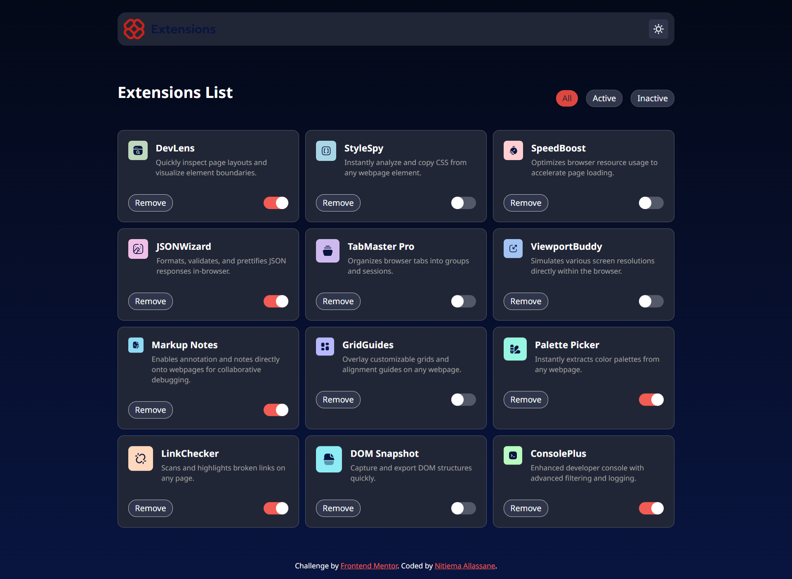
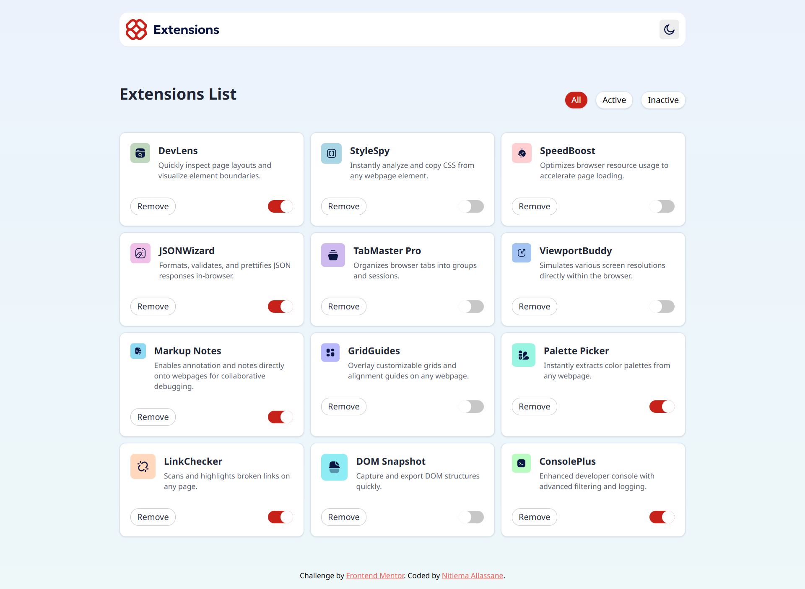
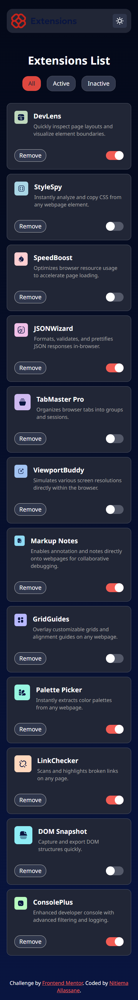
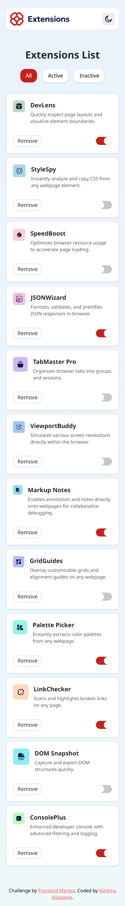

# Frontend Mentor - Browser extensions manager UI solution

This is a solution to the [Browser extensions manager UI challenge on Frontend Mentor](https://www.frontendmentor.io/challenges/browser-extension-manager-ui-yNZnOfsMAp). Frontend Mentor challenges help developers improve their frontend skills by building realistic projects.

## Table of contents

- [Frontend Mentor - Browser extensions manager UI solution](#frontend-mentor---browser-extensions-manager-ui-solution)
  - [Table of contents](#table-of-contents)
  - [Overview](#overview)
    - [The challenge](#the-challenge)
    - [Screenshot](#screenshot)
    - [Links](#links)
  - [My process](#my-process)
    - [Built with](#built-with)
    - [What I learned](#what-i-learned)
    - [Continued development](#continued-development)
    - [Useful resources](#useful-resources)
  - [Author](#author)

---

## Overview

### The challenge

Users should be able to:

* Toggle extensions between active and inactive states
* Filter active and inactive extensions
* Remove extensions from the list
* Select their preferred color theme
* View the optimal layout depending on their device's screen size
* See hover and keyboard focus states for interactive elements

### Screenshot






### Links

* Solution URL: [Frontend Mentor Solution](https://www.frontendmentor.io/)
* Live Site URL: [Live Demo](https://extentions-manager.vercel.app/)

---

## My process

### Built with

* Semantic HTML5 markup
* Mobile-first workflow
* Flexbox
* CSS Grid
* [React](https://react.dev/) - JavaScript library
* [TypeScript](https://www.typescriptlang.org/) - Typed JavaScript
* [Tailwind CSS v4](https://tailwindcss.com/) - Utility-first CSS framework
* [Vite](https://vitejs.dev/) - Frontend tooling
* [Lucide React](https://lucide.dev/) - Icons

---

### What I learned

This project helped me improve my understanding of state management and conditional rendering in React.

I learned how to:

* Filter and display data dynamically
* Toggle extension states using immutable updates
* Create reusable components
* Handle empty states in a cleaner UI
* Implement dark mode using Tailwind CSS v4 custom variants
* Improve accessibility with `:focus-visible`

One part I’m particularly proud of is the toggle functionality:

```ts
const toggleExtensionStatus = (name: string) => {
  setExtensions(prevExtensions =>
    prevExtensions.map(extension =>
      extension.name === name
        ? { ...extension, isActive: !extension.isActive }
        : extension
    )
  );
}
```

I also learned how to simplify conditional rendering by deriving the displayed data instead of duplicating JSX.

---

### Continued development

In future projects, I want to continue improving my skills in:

* Advanced React state management
* Component architecture and reusability
* Accessibility best practices
* Animations and micro-interactions
* Writing cleaner and more maintainable code

I also want to become more comfortable building larger applications with TypeScript.

---

### Useful resources

* [Tailwind CSS Documentation](https://tailwindcss.com/docs) - Helped me better understand dark mode and utility classes.
* [React Documentation](https://react.dev/) - Very useful for understanding state updates and rendering logic.
* [Frontend Mentor Community](https://www.frontendmentor.io/community) - Great inspiration and learning resource.

---

## Author

* Website - [Nitiema Allassane](https://nitiema-allassane.vercel.app/about)
* Frontend Mentor - [@NitiemaAllassane](https://www.frontendmentor.io/profile/NitiemaAllassane)
